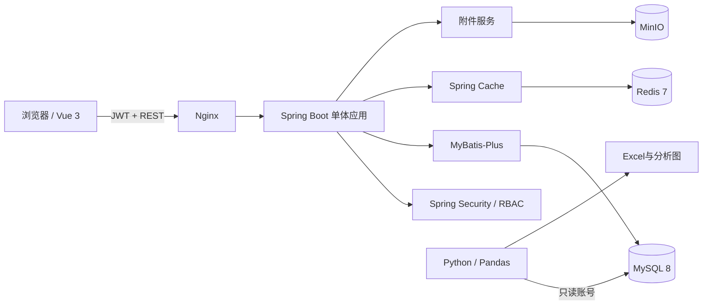

# 系统架构与数据流

## 请求链路

1. Vue 在 `Authorization: Bearer <JWT>` 中携带令牌。
2. JWT 过滤器解析用户名并从数据库重新加载账号状态和角色，禁用账号无法继续访问。
3. Controller 完成参数校验；Service 校验业务角色、数据范围和状态流转。
4. MyBatis-Plus 使用版本号完成乐观锁更新。更新成功后，在同一事务内写入 `work_order_log`。
5. 看板聚合结果进入缓存；工单或设备变更时主动清除看板缓存。

## 一致性边界

- 工单状态与审计日志必须同事务提交或回滚。
- 并发修改时 `UPDATE ... WHERE id=? AND version=?` 影响行数为0，API返回 HTTP 409。
- 附件对象先存储、后写元数据；上传失败不写数据库。生产扩展可增加定时清理孤立对象。

## 安全边界

- 报修人只查询 `reporter_id=当前用户`；维修人只查询 `assignee_id=当前用户`。
- 文件仅允许 JPG、PNG、WEBP、PDF，单请求最大12MB，存储键不使用原始文件名。
- Swagger/Knife4j 在演示环境开放；正式生产应限制为内网或关闭。

