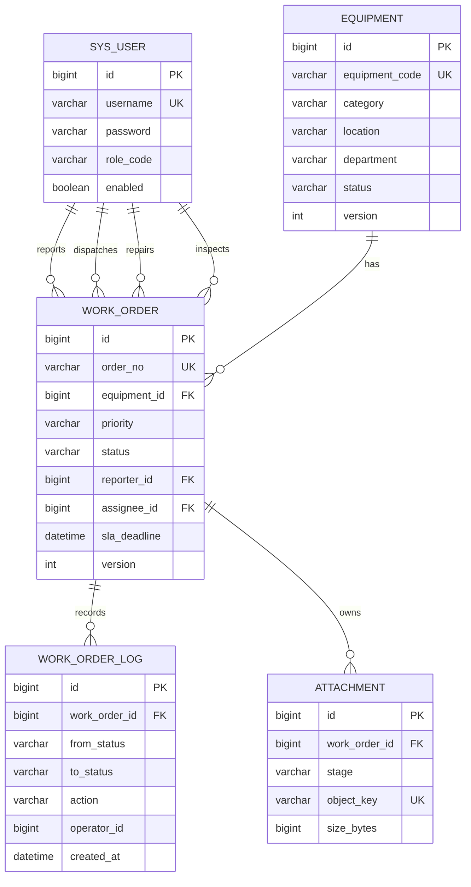

# ER 图

## 索引设计

- `work_order(status, created_at)`：状态列表按时间倒序。
- `work_order(equipment_id, created_at)`：设备维修历史。
- `work_order(assignee_id, status)`：维修人员待办。
- `work_order(reporter_id, created_at)`：报修人员的数据范围。
- `work_order(sla_deadline, status)`：超时工单扫描。

